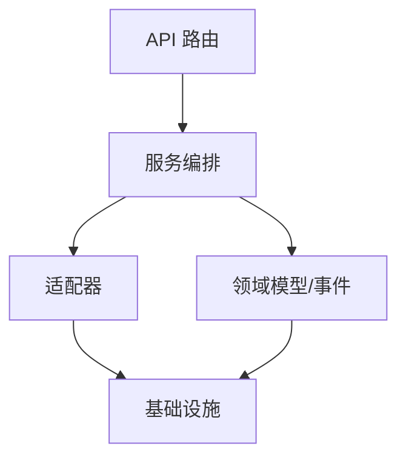

# neoDTH 项目分层与鉴权模块开发计划

## 1. 项目分层结构归纳

- **Domain 层**：领域模型、事件、仓储接口，按业务对象分目录。
- **Adapters 层**：外部系统适配（数据库、MQTT、TCP），实现仓储与协议处理。
- **API 层**：路由、依赖注入、请求/响应模型定义。
- **Services 层**：业务流程编排，聚合领域与适配器。
- **Core 层**：日志、配置、事件总线等基础设施。
- **Tests 层**：按模块分目录，覆盖领域、服务、适配器。

## 2. 后续功能开发分层建议

- 新功能优先在 domain 层定义模型与事件。
- 适配器层实现外部依赖隔离。
- 服务层聚合业务流程，避免 API 层膨胀。
- 保持单一职责，避免跨层调用。

## 3. 文件组织建议

- 领域对象独立目录，models.py、events.py、repository.py 分离。
- Adapters 层按协议/数据库分子目录，仓储实现 xxx_repo.py，协议处理 handler.py/client.py/server.py。
- API 层 routes 按业务对象分文件，依赖注入与路由注册分离。
- Services 层聚合服务与处理器分文件，复杂流程可拆分子目录。
- Core 层基础设施按功能分文件。
- 测试文件 test_xxx.py，按模块分目录。

## 4. 分层结构 Mermaid 图

## 5. 管理员登录鉴权模块分层与文件结构建议

- **domain/admin/**
  - models.py（管理员模型）
  - events.py（鉴权相关事件）
  - repository.py（管理员仓储接口）
- **adapters/admin_repository/**
  - admin_repo.py（管理员仓储实现）
- **services/admin_auth_service.py**（管理员鉴权服务）
- **api/routes/admin_auth.py**（管理员登录接口路由）
- **tests/test_admin_auth.py**（鉴权相关测试）

## 6. 微信用户注册登录鉴权模块分层与文件结构建议

- **domain/user/**
  - models.py（用户模型）
  - events.py（鉴权相关事件）
  - repository.py（用户仓储接口）
- **adapters/user_repository/**
  - user_repo.py（用户仓储实现）
- **adapters/wechat_gateway/**
  - client.py（微信 API 客户端）
  - handler.py（微信鉴权处理器）
- **services/user_auth_service.py**（用户鉴权服务）
- **api/routes/user_auth.py**（用户注册登录接口路由）
- **tests/test_user_auth.py**（鉴权相关测试）

## 7. 开发流程建议

- 先定义领域模型与事件，明确鉴权流程。
- 适配器层实现仓储与微信 API 对接。
- 服务层编排鉴权逻辑，统一异常处理与日志。
- API 层仅负责路由与参数校验。
- 测试覆盖鉴权流程、异常场景与接口安全。

## 8. 组织原则

- 单一职责，分层清晰，接口安全优先。
- 外部依赖隔离，业务流程聚合，测试充分。
